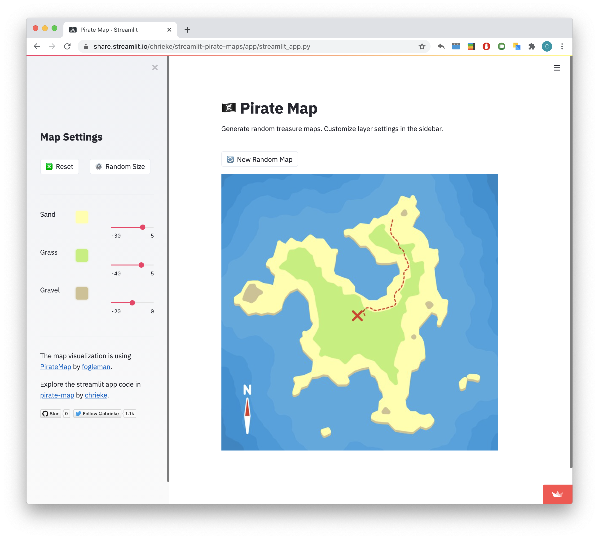

# Streamlit Pirate Maps

A streamlit app to randomly generate pirate treasure maps. 

Based on the [PirateMap](https://github.com/fogleman/PirateMap) code by [fogleman](https://github.com/fogleman).

<h3 align="center">
    Try it out:  
    <a href="https://share.streamlit.io/chrieke/streamlit-pirate-maps/app/streamlit_app.py">Pirate Map live on streamlit!</a>
</h3>

<h3 align="center">
    
</h3>

 

