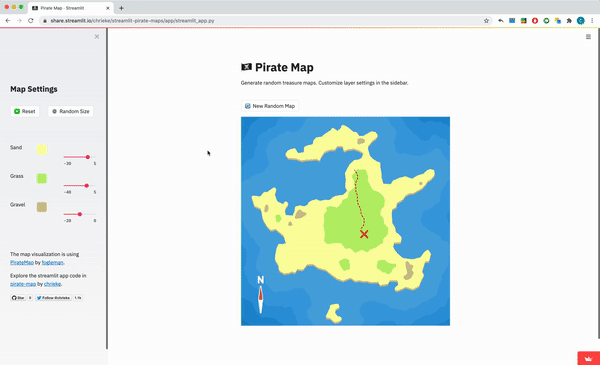

# 🏴‍☠️ Streamlit Pirate Maps

A Streamlit app that generates random pirate treasure maps. Live on [streamlit/streamlit-pirate-map](https://share.streamlit.io/chrieke/streamlit-pirate-map/app/streamlit_app.py).

Based on the [PirateMap](https://github.com/fogleman/PirateMap) code by [fogleman](https://github.com/fogleman).

 

<h3 align="center">
    
</h3>

<h3 align="center">
    Try it out:  
    <a href="https://share.streamlit.io/chrieke/streamlit-pirate-map/app/streamlit_app.py">Pirate Map live on streamlit!</a>
</h3>
